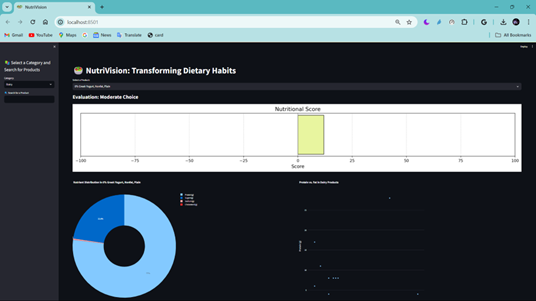
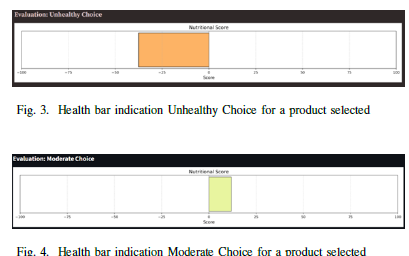
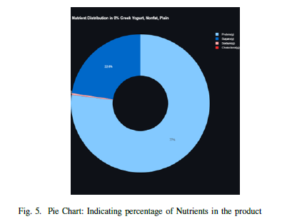
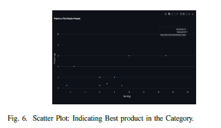

# About NutriVision  
NutriVision is a user-friendly tool designed to simplify nutritional assessment and empower healthier eating habits. By translating complex nutritional data into easy-to-understand visuals, it helps users make informed dietary choices in seconds.  

---

## Key Features  
- **Health Bar Indicator**: A color-coded scale (🟥 to 🟩) that instantly shows a product’s nutritional score.  
- **Interactive Visualizations**: Pie charts and scatter plots to explore nutrient distribution and product comparisons.  
- **Simple Interface**: Built for all users, with drop-down menus and buttons for seamless navigation.  
- **Data-Driven Analysis**: Uses web-scraped nutritional data and Python tools for accurate scoring.  
- **Future-Ready**: Plans to add image-based food recognition and personalized dietary tips using machine learning.  

---

## How It Works  
1. **Data Collection**  
   - Scrape nutritional data from public databases (e.g., Trader Joe’s products).  
   - Focus on metrics like protein, fiber, sugars, and fats.  

2. **Data Prep**  
   - Clean and standardize the data to ensure accuracy.  

3. **Nutritional Scoring**  
   - Calculate a score using a weighted formula:  
     ```python  
     # Example formula snippet  
     score = (protein * 0.3) + (fiber * 0.2) - (sugars * 0.25) - (fats * 0.25)  
     ```  

4. **Visualization**  
   - Generate the Health Bar Indicator and supporting charts (pie/scatter plots).  

5. **User Interface**  
   - Built with Streamlit for easy interaction. Users select products and view scores instantly.  

---

## Built With  
- **Python**: Core programming language.  
- **Pandas**: Data cleaning and analysis.  
- **Matplotlib/Seaborn**: Charts and graphs.  
- **Streamlit**: Interactive web interface.  

---

## What’s Next?  
- 🖼️ **Image Recognition**: Scan food packaging for instant analysis.  
- 🌍 **Global Database**: Expand to include international foods.  
- 🩺 **Healthcare Integration**: Partner with clinics for dietary planning.  

---

## Screenshots  
<!-- Add images below with proper Markdown syntax -->  

 


 






---

**NutriVision** — Simplifying nutrition, one bite at a time. 🥗  